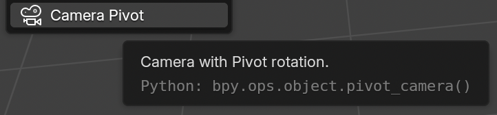
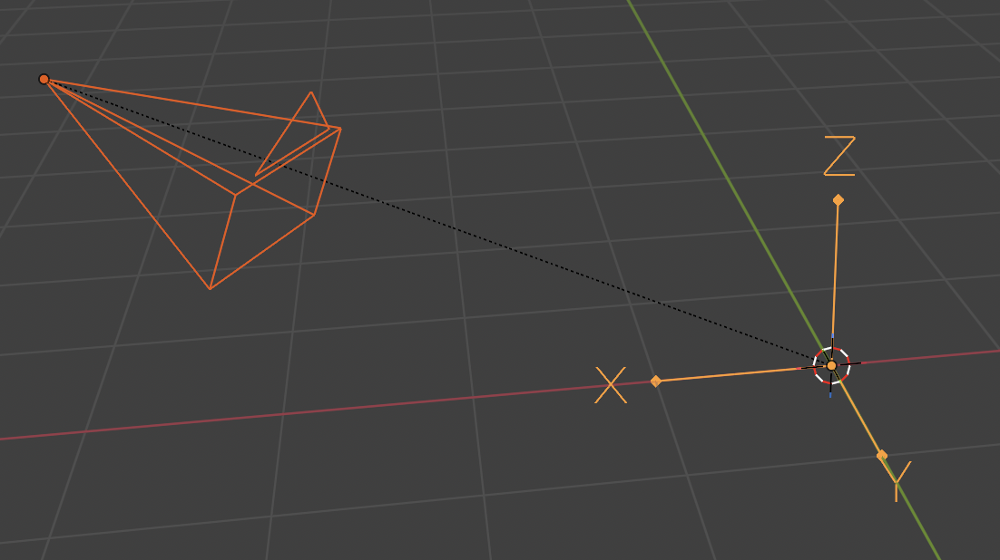
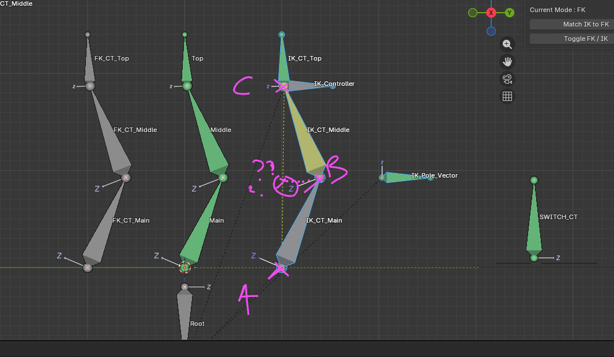
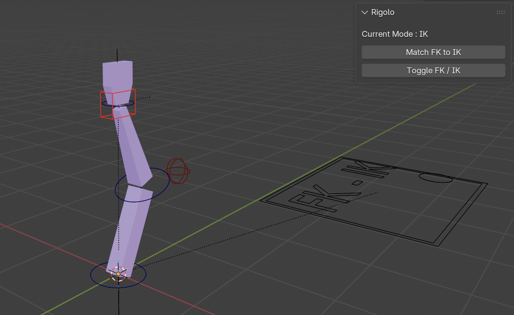

# 🧬 Alchemy

Alchemy is my personal DCC toolbox!

Its main goal is to optimize my workflow when I’m creating (cool) stuff in DCCs.

But ☝️ if others can benefit from it along the way, then let’s go!!

## Use

> [!IMPORTANT]  
> I’ll try to create a simple entry point (CLI or GUI) to launch a DCC with custom tools!


You can create an alias to run the bash script :
```bash
alias blenderx="<alchemy-path>/alchemy/blender/blenderx.sh"
```
Running `blenderx` in a CLI launches Blender with all my custom tools placed in the tools folder.


## DCC
- [Blender](https://www.blender.org/)


## Tool List

- Pivot Camera [🚧]

- Rigolo (custom rig) [🚧]

### Pivot Camera 🎥

A really simple tool, but really useful to quickly get a ready-to-use rotating camera around a specific point!

Ready for fast 360 animation ??





### Rigolo 🦴

I started implementing my own custom rig from scratch!
Right now, I’m focusing on the arm 🦾.

- IK / FK implementation
- Switch between IK / FK (driver or UI button)
- Match from IK to FK, and the other way around, for smooth transitions during animation




